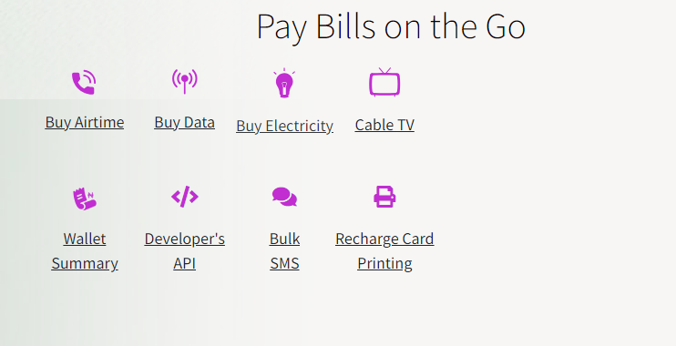

# Project Name

## Introduction
Briefly introduce your project. Explain what it does, its purpose, and why it's useful. Include any relevant links to your deployed site, final project blog article, and author(s) LinkedIn profiles.

- **Deployed Site:** (http://ayodelefasulu.github.io)
- **Final Project Blog Article:** (http://.com)
- **Author(s) LinkedIn:**
  - [Ayodele Fasulu](https://www.linkedin.com/in/ayodelefasulu)
 
## Description
### Why Choose Us?
We offer instant recharge of Airtime, Databundle, CableTV (DStv, GOtv & Startimes), Electricity Bill Payment and more.

## Installation
Provide a step-by-step guide on how to install and set up your project. Include prerequisites, setup commands, and any configuration needed.

# Clone the repository
git clone https://github.com/Ayodelefasulu/Portfolio_project.git

# Navigate into the project directory
cd Portfolio_project

# Install dependencies

